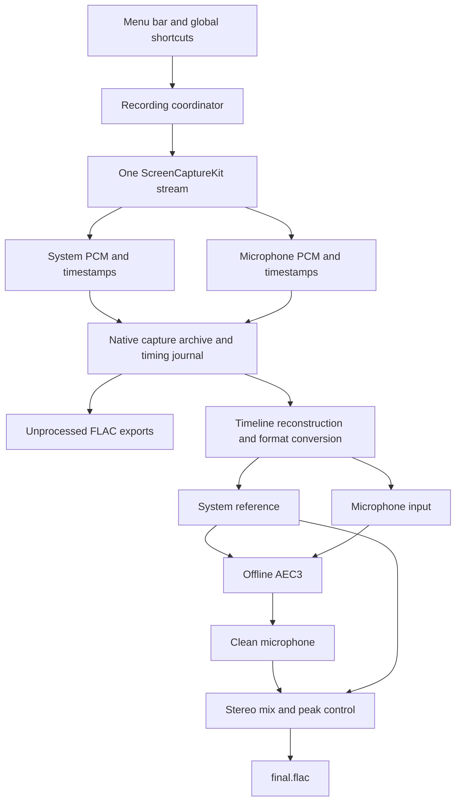

# Local Meeting Audio Recorder — Implementation Plan

Build the MVP in two stages: first prove reliable dual-track capture and offline echo cancellation; then add the menu-bar workflow and release hardening. The principal technical risk is preserving local speech while removing speaker bleed across different audio devices.

This is a greenfield plan for the currently empty Scribe repository. Decisions below are proposed implementation defaults; performance and audio-quality targets are acceptance goals, not measured results.

## 1. Scope and platform decisions

| Area | MVP decision |
| --- | --- |
| Platform | macOS 15 or later; Apple Silicon first. Validate Intel separately before advertising support. |
| Application | Swift with a SwiftUI `MenuBarExtra`; AppKit integration for lifecycle, folder opening, and global shortcuts. |
| Capture | One ScreenCaptureKit `SCStream`, with separate `.audio` and `.microphone` outputs. |
| Audio sources | A remembered meeting application and microphone; an explicit “All System Audio” alternative. Resolve the application’s current process when recording starts. |
| Processing | Offline WebRTC Audio Processing Module using AEC3, wrapped behind a small C/Objective-C++ interface. |
| Output | Unprocessed system and microphone FLAC files, cleaned stereo `final.flac`, and versioned metadata. |
| Distribution | Initially a Developer ID signed, notarized app distributed directly, running without App Sandbox. App Store packaging (and the sandboxing work it implies for global shortcuts, the recordings folder, and bundled helpers) is outside the MVP. |
| Local operation | No accounts, runtime downloads, telemetry, uploads, or meeting-service APIs. Bundle the processing dependencies. |

The installed Apple SDK declares microphone capture and `.microphone` output available from macOS 15. It also specifies that microphone buffers use the device’s native format, independently of the system-audio configuration. Apple demonstrates both outputs on the same stream in its [ScreenCaptureKit microphone introduction](https://developer.apple.com/videos/play/wwdc2024/10088/?time=434).

Audio filtering is application-level. Selecting a browser must be described as recording that browser’s audio; it does not promise isolation of a single Google Meet tab. Verify browser helper-process behavior during the feasibility work. See [Apple’s capture-filter explanation](https://developer.apple.com/videos/play/wwdc2022/10156/).

“No duplicated audio” means no perceptible second copy of meeting playback on the validated device configurations. Perfect cancellation in every room is not a credible guarantee. Audio absent from the reference, clipped microphone input, and changing speaker paths can leave residual echo.

## 2. Architecture



| Component | Responsibility |
| --- | --- |
| `RecordingCoordinator` | Serialize start/stop commands, own capture state, and report actionable errors. |
| `PermissionService` | Check/request capture and microphone permissions and handle denied or revoked access. |
| `CaptureService` | Resolve sources, configure `SCStream`, deliver owned audio buffers, and observe stream failures. |
| `SessionStore` | Create recording directories, stream native PCM to disk, persist timing, and recover incomplete sessions. |
| `TimelineBuilder` | Reconstruct both tracks on a common timeline, account for gaps, and correct measured drift. |
| `EchoCanceller` | Hide the pinned WebRTC dependency behind an offline, block-based interface. |
| `MixdownService` | Place cleaned microphone audio on the original timeline, mix, and encode the final file. |
| `ProcessingQueue` | Persist pending jobs, run one job at a time, and prioritize active capture. Expose the scheduler contract that other local jobs (for example the transcription module) use to defer or suspend while a recording is in progress. |
| `HotkeyService` | Register configurable global start/stop shortcuts and report conflicts. |

Use a Swift actor for recording coordination and explicit serial queues for capture delivery, disk writing, and DSP. Keep synchronous WebRTC processing off the main actor. Callbacks only validate, retain or copy buffer data into bounded storage, and enqueue it; they must not run AEC or perform blocking disk writes. Never let no-copy audio pointers outlive their backing sample buffer.

## 3. Capture and synchronization

1. Preflight permissions, source availability, destination writability, and free space. Create a session UUID and initial manifest before capture begins.
2. Resolve the selected application and microphone. If the selected application is unavailable, show a source-selection error; do not silently broaden capture to all applications.
3. Configure system capture at 48 kHz stereo, enable microphone capture, and exclude Scribe’s own audio (`excludesCurrentProcessAudio`). Inspect the format description of every incoming buffer, especially the microphone stream. Apple documents the system [sample-rate](https://developer.apple.com/documentation/screencapturekit/scstreamconfiguration/samplerate) and [channel-count](https://developer.apple.com/documentation/screencapturekit/scstreamconfiguration/channelcount) settings.
4. Register `.audio` and `.microphone` outputs. Do not save screen frames. Verify audio-only operation and CPU usage on the minimum supported macOS release; if the stream needs a screen consumer on a tested configuration, use the smallest supported low-frame-rate configuration and discard those frames immediately.
5. Persist native audio with presentation timestamps, frame counts, format information, and source identity. Use a monotonic media timeline; wall-clock time is only for naming and metadata.
6. Record each track’s initial timestamp and contiguous runs. Journal gaps, overlaps, format changes, and interruptions with their corresponding file offsets.
7. On stop, await stream shutdown, drain callback and writer queues, close native files, commit the capture manifest, and enqueue post-processing. “Recording stopped” and “Final recording ready” are separate events.

A shared `SCStream` simplifies timing but is not proof of sample-exact alignment. The feasibility test must establish how both timestamp domains relate. Convert through the relevant Core Media clock relationship if required, rather than assuming callback arrival times are comparable.

For offline processing, establish one session origin and map samples to a 48 kHz timeline using rational timestamp arithmetic. Preserve initial offsets and account for resampler latency. Insert silence only for documented missing intervals; never concatenate across a gap and shorten a track. Compare timestamp progression with sample counts to detect drift, then apply gradual resampling to the processing copy if necessary. Preserve the source archive unchanged.

Silence is valid input. A silent meeting must not be mistaken for a capture failure. Diagnose missing streams using capture state, timestamp continuity, microphone delivery, and controlled playback tests rather than audio level alone.

## 4. Storage, originals, and recovery

```text
~/Meeting Recordings/
  2026-09-03 15-30-12/
    final.flac
    metadata.json
    capture/
      system-0001.caf
      microphone-0001.caf
      timeline.jsonl
```

Use an atomic directory-creation operation and add a short UUID suffix if the timestamp name collides. Store timestamps with their time-zone offset in metadata. `metadata.json` is the session manifest referred to throughout this document. The session directory is owned by the recorder; other modules read from it but write their own output elsewhere.

Write transcription-oriented 48 kHz mono 16-bit PCM to recoverable CAF segments during recording. Downmix and quantize float input during the owned-buffer copy without changing frame counts or timestamps. Rotate at a bounded interval, initially 60 seconds, and on format changes. Checkpoint the timing journal so a crash cannot invalidate the whole meeting. Verify recovery of the active segment from persisted format and byte-count information.

After capture, normally generate only the mixed `final.flac`. The recoverable CAF tracks remain the source archive, while explicit diagnostic or recovery tooling may generate separate source FLACs on demand. Avoid retaining redundant automatic exports.

FLAC remains lossless relative to the transcription-grade 16-bit integer mix supplied to it. Verify the encoded stream before publication and retain the CAF archive for reprocessing.

The manifest should include:

- Schema version, session UUID, app build, macOS version, start/end times, duration, and completion status.
- Capture scope, application bundle/process identifiers, microphone identity, and observed output-device changes.
- Per-track source formats, first media timestamps, frame counts, files, checksums, and journal references.
- Gap/interruption information and reasons for stopping.
- Processing state, dependency versions, configuration, resampling and delay corrections, mix gains, and errors.

Use separate capture and processing states, such as `capturing / complete / interrupted` and `pending / running / complete / failed`. Write manifests through an atomic replacement. Publish FLAC files through temporary files and rename only after successful finalization and verification.

The manifest is also the contract consumers rely on. The transcription module’s importer (see [TRANSCRIPTION_IMPLEMENTATION_PLAN.md](TRANSCRIPTION_IMPLEMENTATION_PLAN.md), section 4) preselects `final.flac` only when it finds a recognized schema version, a processing state of `complete`, and a matching `final.flac` checksum. Treat these three fields as stable once the schema is versioned; add fields rather than renaming them.

On launch, scan incomplete manifests, recover available raw audio, and resume pending processing. Reprocessing writes a new temporary result and replaces `final.flac` only on success. Originals are never overwritten. Provide a small local `scribe-process <session-directory>` developer tool so recovery and reruns are testable without the UI.

Budget disk space for two 48 kHz mono 16-bit CAF tracks plus one mono 16-bit FLAC. This is about 691 MB per hour before FLAC compression, versus several gigabytes for native multi-channel float capture. Stream the final encode directly without a session-length mix scratch file. Monitor actual free space and stop cleanly before exhaustion.

## 5. Offline echo cancellation and mixdown

Use a pinned WebRTC Audio Processing Module build with AEC3 enabled and a reproducible build script. Expose construction, configuration, render-frame analysis, capture-frame processing, reset, and metrics through a narrow bridge. Include dependency notices and licenses in the app bundle.

At 48 kHz, feed the module 480 samples per channel per 10 ms block. Supply system playback through the reverse/render path before processing the corresponding microphone block. Configure mono microphone processing and widen the mono render signal only where the pinned WebRTC interface requires it. Disable automatic gain control and optional noise suppression initially to isolate AEC behavior. These API requirements are documented in the [WebRTC audio-processing interface](https://webrtc.googlesource.com/src/+/refs/heads/main/api/audio/audio_processing.h).

The offline processor should:

1. Reconstruct the timeline and convert working buffers to 48 kHz float PCM.
2. Estimate plausible render-to-microphone delay from correlated playback-only regions when available, using confidence checks that reject local speech and silence.
3. Feed the reference and microphone chronologically through AEC3. Model the offline render/capture delay consistently with the pinned API; do not substitute the wall-clock duration of a processing call for acoustic delay.
4. Let the adaptive filter converge and track changing echo paths. Reset or reconverge at documented discontinuities and device changes.
5. Preserve double-talk: local speech must survive when meeting participants are speaking simultaneously. Do not use a rule that simply mutes the microphone whenever system audio is active.
6. Treat uncertain delay estimates conservatively. A failed AEC job retains originals and reports failure; it must not publish a raw doubled mix as a successfully cleaned result.
7. Keep cleaned microphone output on its original capture timeline, compensating only for introduced DSP latency. Echo-reference alignment must not move the user’s speech earlier in the meeting.
8. Mix the original system signal with the cleaned microphone into mono using conservative fixed gains that reserve sample headroom. Avoid a scratch-file peak-normalization pass and unrelated loudness processing.
9. Stream `final.flac` directly at 48 kHz, mono, 16-bit PCM. Flush partial final blocks and trim padding so the output retains the session duration.

AEC only knows about audio present in its reference. In application-specific mode, unrelated notifications or music reaching the microphone may remain. System volume, speaker processing, Bluetooth latency, and existing device microphone processing can also change the echo path. Validate these cases explicitly; do not assume captured playback is identical to the physical speaker signal.

Keep processing streaming and memory-bounded. Persist job state so it can restart from originals after a crash. Start with one background job, paused or throttled while a new meeting is being captured. No live microphone monitoring is needed.

## 6. Menu-bar workflow

- Show Idle, Starting, Recording with elapsed time, Stopping, and Error states. Show background-processing progress separately so another recording can start after raw capture has closed.
- Provide Start Recording, Stop Recording, source and microphone selection, Open Recordings Folder, a small Settings window, and Quit.
- Settings covers the recordings folder location (default `~/Meeting Recordings`), remembered application and microphone, the two global shortcuts, and a “Transcribe when the final recording is ready” toggle. Persist settings in `UserDefaults`; keep the recordings folder as a security-scoped bookmark so a later sandboxed build does not need a migration.
- Offer separate configurable global start and stop shortcuts. Register discrete shortcuts through a `RegisterEventHotKey` wrapper; verify behavior on supported macOS versions and report registration conflicts. Menu actions remain available if a shortcut cannot be registered.
- Serialize menu and shortcut commands through the same coordinator. Debounce repeated key events; start while recording and stop while idle are harmless.
- First run requests Screen & System Audio Recording and microphone access, with a clear route back to System Settings after denial. Include the microphone usage description and signing capabilities required by the chosen distribution configuration.
- Keep macOS’s normal capture and microphone indicators. There is no meeting participant or bot, but capture is still visible through the operating system’s privacy UI.
- Quitting during capture performs a normal stop and saves originals. Pending processing can resume on the next launch.
- When the transcribe-on-completion toggle is on, submit a `TranscriptionRequest` for `final.flac` only after it has been published and verified. If cleanup failed, do not hand off a raw track; surface the failure instead. Capture and cleanup never wait on transcription.

## 7. Implementation milestones

| Milestone | Deliverables | Exit criteria |
| --- | --- | --- |
| 1. Audio feasibility | Minimal signed capture harness, timestamp inspector, pinned AEC build, offline processing harness, and recorded fixtures. | Capture real system/mic pairs on macOS 15; establish clock alignment; demonstrate useful echo reduction without losing local speech on built-in speakers and a USB microphone. Resolve major AEC limitations before UI work. |
| 2. Reliable recording core | `CaptureService`, coordinator, native archive, timing journal, permission handling, and stop/drain logic. | A two-hour recording preserves both tracks; repeated start/stop works; interrupted recordings recover without corrupting completed segments. |
| 3. Audio processing and files | Timeline reconstruction, format conversion, AEC bridge, mixer, FLAC exporter, metadata, processing queue, and the `scribe-process` developer tool. | Fixture suite meets alignment and audio-quality gates; reruns use saved originals; failed processing never overwrites a valid final file. |
| 4. Menu-bar MVP | Menu states, shortcuts, settings, source selection, folder opening, and recovery feedback. | Complete start → stop → process → open-folder flow works while a meeting app is foregrounded. |
| 5. Release hardening | Device/app matrix, resource profiling, fault injection, signing, notarization, and clean-machine installation. | Acceptance gates below pass on the declared support matrix; installation and recording require no developer tools or network access. |

Dependencies are sequential: feasibility → capture core → processing → UI → release validation. A planning allowance is roughly 4–6 weeks for one engineer experienced with macOS and native audio, with the estimate revisited after milestone 1. AEC integration and device compatibility dominate uncertainty.

## 8. Validation and release gates

Build deterministic fixtures from a known playback signal, a simulated delayed/reverberant echo path, and an independent local-speech signal. Include silence, double-talk, delay changes, drift, clipping, asymmetric stereo, different microphone sample rates, and gaps. Pair these tests with real-room recordings; synthetic success alone is insufficient.

| Area | Proposed gate |
| --- | --- |
| Capture reliability | Two-hour normal recording with no unexplained missing frames or growing memory use; at least 50 repeated start/stop cycles. |
| Timeline correctness | At most one 10 ms processing block of residual alignment error in calibrated fixtures at start and end; no cumulative drift beyond that bound. |
| Echo reduction | At least 20 dB median echo-energy reduction after convergence in controlled far-end-only fixtures; no clearly audible second copy in listening checks on supported speaker configurations. |
| Local speech | Less than 1 dB level change in near-end-only fixtures before mix gain, after compensating processing delay; no lost words in double-talk listening checks. Adjust AEC settings if suppression damages speech. |
| File correctness | All exports decode, expected channel counts/rates are present, durations match the reconstructed timeline, and reruns leave original checksums unchanged. |
| Resource use | Initial budget on the declared baseline Mac: capture below 10% of one CPU core on average and app memory below 200 MB; processing at least twice real time. Measure in a release build and revise architecture if capture misses the budget. |
| Fully local operation | Capture, processing, folder opening, and recovery all work with networking disabled. |
| Recovery | Forced termination during capture, FLAC encoding, and manifest replacement leaves completed originals recoverable; restarting completes or clearly reports pending work. |

Test Zoom, Google Meet in Safari and Chrome, and Teams. Cover built-in speakers/microphone, wired headphones, a USB microphone, and Bluetooth playback/input modes. Test minimized windows, multiple displays, app relaunch, rapid shortcut presses, permission revocation, missing inputs, low disk space, screen lock, and sleep/wake.

For MVP interruptions, prefer a clearly marked partial recording over an unreported gap: stop and finalize on microphone disconnection, selected-app exit, unrecoverable stream error, or sleep. Output-route changes may continue if timestamps remain valid, but must be journaled and trigger AEC reconvergence. Screen lock behavior must be measured on each supported OS. Automatic reconnection can follow after the basic reliability gates pass.

## 9. Suggested repository layout

```text
Scribe.xcodeproj/
Scribe/
  App/
  Capture/
  Storage/
  Processing/
  Platform/
  UI/
Native/
  WebRTCBridge/
  FLACBridge/
Modules/            # feature modules with their own contracts; see the transcription plan
Workers/            # bundled helper executables launched as child processes
Tools/
  ScribeProcess/
Tests/
  Capture/
  Timeline/
  Processing/
  Recovery/
  Fixtures/
Scripts/
  build-native-dependencies.sh
  package-app.sh
```

`Modules/` and `Workers/` are reserved for the transcription and speaker-library modules laid out in [TRANSCRIPTION_IMPLEMENTATION_PLAN.md](TRANSCRIPTION_IMPLEMENTATION_PLAN.md), section 12. The shared scheduler contract and the producer handoff types live in `Scribe/App/` so neither module depends on the other’s internals.

Keep recording manifests and the processing interface versioned. Later transcription, speaker identification, summaries, and search can consume completed sessions as separate local jobs without changing capture or overwriting source audio. Meeting detection, live AEC, pause/resume, editing, and an archive browser remain outside this MVP.
