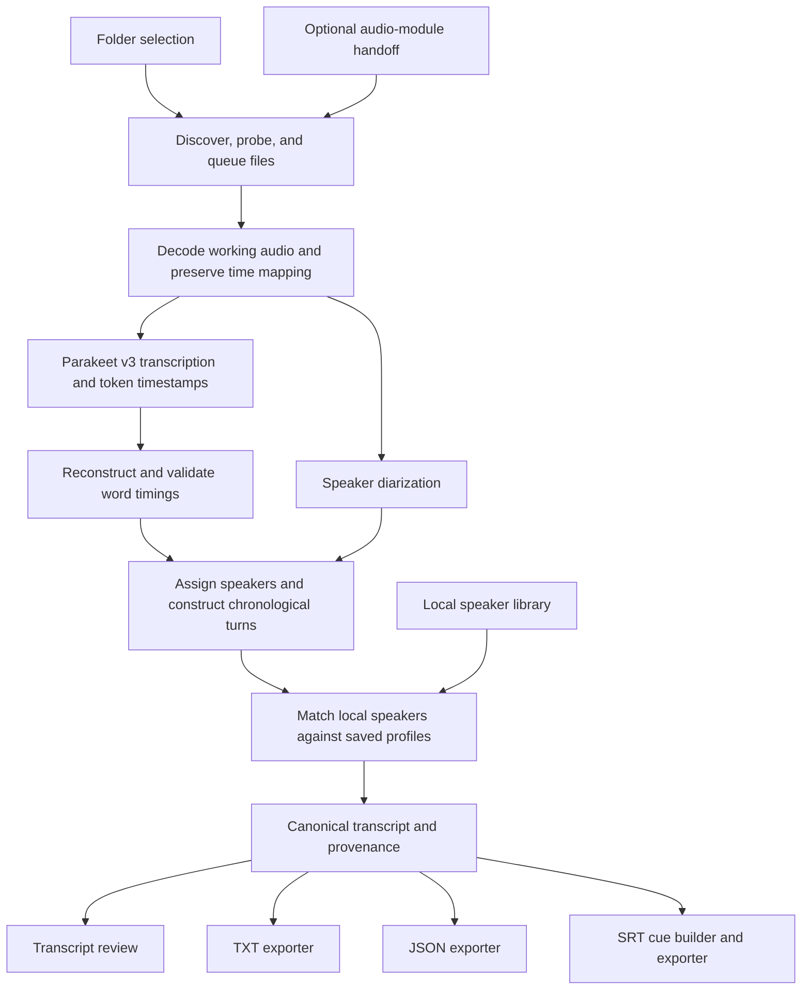

# Transcription Module — Specification and Implementation Plan

Build an independent local module that imports audio files from a folder, transcribes speech, identifies speaker turns through diarization, and presents the transcript chronologically. Export TXT, JSON, and SRT, with speaker, text, and start/end timestamps in every segment or subtitle cue.

The audio module described in [IMPLEMENTATION_PLAN.md](IMPLEMENTATION_PLAN.md) is one possible producer. This module must also work with recordings from phones, voice recorders, downloaded audio, other applications, and existing archives. It must not require the audio module to be installed or running.

The decisions and acceptance targets below are proposed implementation defaults, not measured results.

## 1. MVP behavior and boundaries

1. The user chooses a local folder and sees its supported audio files.
2. The user selects one or more files and starts transcription.
3. Each file becomes a separate job with progress, cancellation, retry, and its own transcript.
4. The module performs speech recognition, timestamp alignment, and speaker diarization locally.
5. The transcript view displays consecutive speaker turns in chronological order, with timestamps and the corresponding text.
6. The user exports TXT, JSON, SRT, or all three without running the models again.

“Grouped by speaker” means consecutive contributions by the same speaker form a turn. A conversation remains Speaker 1 → Speaker 2 → Speaker 1; it is never rearranged into one collection of everything Speaker 1 said followed by everything Speaker 2 said.

Each diarized speaker has a recording-local ID. An optional persistent speaker library links that ID to a saved person when voice matching is sufficiently reliable. A saved profile can contain a name only, or a name plus enrolled voice signatures. Profiles without signatures remain available for manual assignment but are excluded from automatic matching.

The MVP is batch processing of completed files, with optional enrollment and automatic matching against the local speaker library. Live transcription, watched folders, translation, summaries, transcript text editing, and joining separate recordings are outside scope. Uncertain recognition and overlapping speech must remain visible rather than being presented as perfectly resolved.

## 2. Engine and deployment decisions

| Area | Proposed decision |
| --- | --- |
| Host integration | Swift module within the macOS application; matching the host’s macOS 15 minimum. Apple Silicon is the first validation target. |
| ASR model | NVIDIA `parakeet-tdt-0.6b-v3`, using a pinned `FluidInference/parakeet-tdt-0.6b-v3-coreml` conversion. |
| Diarization pipeline | FluidAudio's offline pipeline: pyannote segmentation, WeSpeaker embeddings, and PLDA/VBx clustering over the complete file. Pin its model assets separately from Parakeet. |
| Persistent speaker matching | A local speaker library and a separate matcher using compatible enrolled WeSpeaker embeddings. Match after diarization, with an explicit unknown outcome. |
| Timing | Use Parakeet decoder timestamps, reconcile tokens into words, and validate boundaries. A separate forced-alignment model is not part of the initial pipeline. |
| Runtime | A bundled native Swift helper using a pinned FluidAudio release and Core ML, launched as a child process. No Python runtime, CUDA, Homebrew, or terminal setup required. |
| Hardware profile | Apple Silicon for the initial release; benchmark Core ML compute-unit settings, precision, and chunk sizes on the supported Macs. Intel requires a separately validated backend. |
| Decoding | A bundled, pinned FFmpeg/ffprobe build for common local audio formats. AVFoundation already decodes every format in the initial matrix except Ogg/Opus; FFmpeg is chosen for Ogg/Opus, uniform probing, and tolerance of damaged files. If LGPL packaging proves burdensome, drop Ogg/Opus from the initial matrix and use AVFoundation instead. |
| Processing location | Entirely on the user’s Mac, with locally installed models and telemetry disabled. |
| Results | One versioned canonical transcript, with three deterministic exporters. |

Parakeet v3 is a 600-million-parameter ASR model with automatic punctuation, language detection, and word/segment timestamps. It supports 25 European languages, including English and German, and is distributed under CC-BY-4.0. It supplies transcription, not speaker identities; diarization is a separate processing stage. See the [NVIDIA model card](https://huggingface.co/nvidia/parakeet-tdt-0.6b-v3).

FluidAudio provides a macOS batch adapter for the Core ML conversion and exposes token timings through its ASR result. The adapter must turn these into word intervals using the model vocabulary and tokenizer rules. Verify timestamp units, punctuation attachment, and chunk offsets against the pinned API rather than assuming the Core ML result matches NeMo's output structure. See [FluidAudio's ASR API](https://github.com/FluidInference/FluidAudio/blob/main/Documentation/API.md).

Use `OfflineDiarizerManager` for the separate full-file speaker analysis. Its pipeline combines segmentation, embeddings, and global clustering, with disk-backed audio support. Persist overlapping speaker intervals when exposed, and verify overlap behavior in the pinned build. See [FluidAudio's offline diarization documentation](https://github.com/FluidInference/FluidAudio/blob/main/Documentation/Diarization/GettingStarted.md).

Pin library code, upstream and converted model revisions, vocabulary, diarization weights, clustering parameters, any voice-activity-detection model used to select speech regions, and checksums together. Verify distribution terms for every artifact, include required attribution and notices, and select a suitable FFmpeg build configuration using the project's [distribution guidance](https://ffmpeg.org/legal.html). Package approved assets during release preparation so normal use needs no model-hosting account or token.

Load all ASR and diarization assets from explicit local paths and disable runtime download helpers and telemetry. Missing assets produce a setup error. FluidAudio documents [manual ASR model loading](https://github.com/FluidInference/FluidAudio/blob/main/Documentation/ASR/ManualModelLoading.md); the release package must also include the complete offline diarization asset set, including clustering data. Test model loading and inference with networking blocked.

Validate English and German first and publish the full supported-language list from the pinned model manifest, distinguishing upstream support from locally tested coverage. Use the model's automatic language behavior. An optional user-specified expected language is metadata and a validation hint, not a promise that the decoder can be forced into that language. If the runtime does not return a reliable language label, store it as unknown or user-provided with provenance; do not infer a confident label from an API that does not expose one.

The Core ML conversion is an implementation choice that must pass the quality and timestamp gates. Benchmark it with speech crossing chunk boundaries and differing amounts of surrounding context. NVIDIA's long-context limits and published throughput do not establish the converted runtime's limits. Keep Parakeet v3 as the selected model; reconsider the adapter or add a timestamp-refinement stage only if measured failures require it.

## 3. Module contract and architecture

The public API accepts a local file and options, not capture-session internals:

```text
TranscriptionRequest
  requestID
  sourceURL
  languageMode: automatic
  expectedLanguage: optional language code, for metadata/validation
  speakerCount: automatic | known count
  speakerMatching: enabled | disabled
  speakerLibraryRevision: optional snapshot used for matching
  modelProfileID
  exportDirectory: optional; where exports are written when the caller wants them somewhere other than the transcript store
  provenance: optional producer ID and session ID

TranscriptionEvent
  requestID
  stage
  progress: optional completed/total units
  warning or error: optional structured value

TranscriptionResult
  transcriptID
  revision
  canonicalTranscriptURL
  status: complete | completeWithWarnings | noSpeech
```

The canonical transcript and its run directory always live in the transcript store described in section 8; `exportDirectory` only redirects the TXT/JSON/SRT files. This is what keeps read-only input folders workable.



| Component | Responsibility |
| --- | --- |
| `FolderImportService` | Enumerate local files, probe media, identify completed recorder output, and report skipped files. |
| `TranscriptionCoordinator` | Own job state, cancellation, retries, and the shared application scheduler contract. |
| `AudioPreparationService` | Create a stable working source, decode audio, normalize channels/rate, and retain timestamp mapping. |
| `TranscriptionEngine` | Abstract Parakeet ASR, token/word timing reconciliation, and the separate diarization adapter. |
| `WorkerClient` | Launch the bundled native Swift helper, exchange versioned JSON messages, and handle crashes and cancellation. |
| `SpeakerTurnBuilder` | Assign words to speakers, preserve chronological order, and flag uncertain attribution. |
| `SpeakerProfileStore` | Persist named people, optional enrolled signatures, model provenance, and library revisions. |
| `SpeakerIdentityMatcher` | Compare eligible speaker embeddings with saved profiles and return matched, suggested, or unmatched results. |
| `TranscriptStore` | Persist canonical data, processing provenance, revisions, and recovery checkpoints. |
| `TranscriptViewModel` | Expose speaker turns, timestamps, playback selection, and export actions. |
| `TranscriptExporter` | Generate TXT and JSON, and derive subtitle-sized SRT cues from the same transcript revision. |

Use structured JSON over standard input/output for worker requests and events, with diagnostic logs on standard error. Pass file paths as process arguments or JSON values without shell interpolation. Bound message sizes and stream results to disk rather than returning an entire long recording in one IPC message.

Keep worker execution outside the UI process. Use one transcription worker at a time and release models between heavy stages where practical. The diagram shows recognition and diarization as independent branches because they are; in the MVP they still run one after the other in the same worker so that only one model set is resident at a time. Coordinate with the host’s audio scheduler: active recording has priority; defer transcription starts during capture and suspend at safe stage boundaries or stop/restart the worker if memory pressure threatens recording.

## 4. Folder import and the audio-module handoff

- Scan the selected folder without recursion by default; offer “Include subfolders.” Sort the import list naturally by relative filename. File-list order does not imply one shared recording timeline.
- Support WAV, FLAC, MP3, M4A/AAC, AIFF, CAF, and Ogg/Opus in the initial decoder matrix. Probe the actual container, codec, and audio stream instead of trusting the extension. “Any source” means no producer-specific dependency; encrypted or unsupported media receives a clear per-file error.
- Process each selected file independently. If a container has multiple audio streams, let the user choose one; do not silently combine unrelated tracks.
- Ignore hidden files, temporary files, module output directories (including the transcript store and any `capture/` segment directory inside a recorder session), and symlink traversal outside the selected tree. Allow ordinary explicitly selected local files regardless of their producer.
- Fingerprint the source content and processing configuration to identify repeat imports. Offer the existing result or an explicit rerun. Files with identical names in different folders must not collide.
- Create a stable local snapshot for processing and playback. Verify that the source did not change during snapshot creation; changing or incomplete files return to a waiting/error state. Do not modify or relocate originals.
- Permit output to a separate writable directory so read-only input folders are supported.

When a folder contains a recognized, versioned audio-module manifest (`metadata.json`), preselect its successfully finalized `final.flac`. Recognition requires a supported schema version, a processing state of `complete`, and a `final.flac` checksum that matches the file on disk; any other state leaves the file unselected with a visible reason. Keep `system.flac`, `microphone.flac`, and native capture segments unselected to avoid transcribing the same meeting repeatedly. They remain available for explicit selection. A filename alone is not sufficient to infer that a folder is a recorder session.

The optional producer handoff is an ordinary `TranscriptionRequest` containing the finalized file URL and session ID. Trigger it only after final-file publication when the user has enabled transcription on completion. Audio capture must not wait for transcription. If audio cleanup failed, do not silently substitute a raw track.

Do not infer that a microphone track contains only one person, or that stereo channels correspond to different speakers. Diarization remains necessary for arbitrary input.

## 5. Processing and speaker-turn construction

1. **Validate and prepare:** inspect duration and format, check storage/model availability, and decode a working 16 kHz mono stream for the initial engine. Preserve the input and its playback copy. Evaluate stereo downmixing for phase cancellation; flag suspicious cases and allow channel selection rather than discarding speech silently.
2. **Preserve timing:** define zero as the start of the decoded source media timeline. Record decoder offsets and resampling mapping. Speech detection may choose processing regions, but must not remove pauses from the exported timeline.
3. **Recognize speech:** run Parakeet v3 on speech regions with the pinned model and decoder options, retaining token timestamps. Use automatic language handling. Suppress empty/no-speech output and handle silent files as a successful empty transcript. Keep punctuation and the original language; do not summarize or rewrite speech.
4. **Reconcile word times:** reconstruct words from timed tokens and restore source-relative offsets. Validate start/end bounds and attach punctuation without creating empty cues. Preserve text with missing or invalid timings within its enclosing recognized segment and mark timing quality. Do not fabricate precise word times or run a separate aligner by default.
5. **Diarize the complete recording:** run the independent offline diarizer to estimate speaker turns and count, optionally using a user-supplied known count. Preserve overlapping turns and keep any exclusive text-attribution choice separate from the underlying diarization.
6. **Assign speakers:** associate timed words with the strongest temporal overlap with a speaker turn. Require adequate overlap evidence; use an unknown speaker when attribution is absent or ambiguous. Keep overlap flags even when choosing one primary text attribution.
7. **Build display segments:** merge neighboring words from the same speaker into sentence/turn segments; split at speaker changes, sentence boundaries, or a pause of about one second. Cap very long segments at a suitable word boundary, initially around 30 seconds. Do not merge across an intervening speaker.
8. **Resolve saved identities:** when enabled, match the recording-local speakers against a snapshot of the enrolled speaker library. Attach accepted profile IDs and name snapshots; leave uncertain matches generic.
9. **Validate and persist:** check bounds, text preservation, speaker references, identity provenance, and chronology. Save one canonical transcript before declaring the job complete.

Map anonymous speaker IDs to Speaker 1, Speaker 2, and so on in order of first appearance. Keep these recording-local IDs stable for the saved transcript and all exports. Run optional identity matching after diarization and turn construction to attach saved profile IDs and display names. A fresh diarization run may change clusters; recompute identity matches instead of copying names by cluster index.

For long recordings, chunk ASR with overlap and restore absolute offsets, removing only proven boundary duplicates. Maintain global speaker clustering across the file; independently diarizing each chunk would cause speaker IDs to change. Benchmark the actual worker’s long-file memory behavior, including decoding and clustering. If necessary, use disk-backed waveforms and embeddings, then perform global clustering over retained embeddings.

Overlapping voices are not reliably separable from every mixed recording. Preserve recognized text with an overlap/uncertainty marker, but do not invent missing speech or duplicate the same words under two speakers. Store untranscribed speech intervals as diagnostics rather than fabricating text.

### Persistent speaker library and optional voice signatures

Maintain a small local directory of people, for example Jake, Sarah, and Alex. A voice signature is one or more speaker embeddings extracted from known speech; adding a person does not require retraining Parakeet. Parakeet continues to produce words and timestamps while this service resolves identities from the separate speaker-embedding model.

FluidAudio documents per-speaker embeddings in `DiarizationResult.speakerDatabase` and export support. These are useful integration points, but a persistent registry, cross-recording matcher, and calibrated unknown-speaker policy remain application responsibilities. Verify that the exported vectors have a consistent representation across recordings; otherwise extract compatible embeddings directly from selected clean speech. See the [speaker-embedding documentation](https://github.com/FluidInference/FluidAudio/blob/main/Documentation/Diarization/GettingStarted.md).

**Enrollment workflow:**

1. Create a speaker with a name, leaving their voice signature optional.
2. In a transcript, assign a speaker turn or verified cluster to that person. Offer “Remember this voice for future recordings” separately from assigning the current transcript's label.
3. Let the user listen to and confirm clean examples containing only that person. As an initial collection target, gather about 20–60 seconds of usable speech across several excerpts; validate the required duration experimentally rather than enforcing this as a model guarantee.
4. Exclude silence, overlap, clipping, very short utterances, and visibly inconsistent clusters. Do not enroll an entire cluster blindly when diarization may have merged different people.
5. Extract normalized embeddings with a pinned model and preprocessing configuration. Store several verified examples or representative vectors, allowing samples from different microphones and call conditions.
6. Provide an alternative to enroll from a selected audio file. The same quality checks and confirmation apply.

**Profile storage:**

```text
SpeakerProfile
  profileID: stable UUID
  displayName
  automaticMatchingEnabled
  signatures: optional list
    signatureID
    embeddingVector
    embeddingModelID / revision / preprocessingVersion
    normalization and transform version
    usableSpeechDuration / quality indicators
    enrollmentSourceID and selected time ranges
    optional retained enrollment clip
    confirmedAt
  createdAt / updatedAt
```

Use a local SQLite store under the application's support directory. Signature vectors and optional enrollment clips stay local and are excluded from transcript exports. Let users remove a signature, disable matching, or delete a profile. Store enrollment clips only when the user chooses to retain them for review or rebuilding signatures after a model update.

**Matching behavior:**

- After full-file diarization, gather several clean speech embeddings for each recording-local speaker. Skip automatic identification when there is too little reliable speech.
- Compare only vectors produced by compatible embedding models, preprocessing, normalization, and transforms. Use normalized-vector similarity as the initial scoring method, then calibrate it on held-out recordings from different sessions and microphones.
- Match a saved person only when the best score passes an absolute threshold, exceeds the second-best candidate by a calibrated margin, and is consistent across the clean excerpts. The absolute threshold still applies when the library contains only one person.
- Use three outcomes: matched, suggested for review, or unmatched. Suggestions keep the generic transcript label until confirmed; unmatched speakers remain Speaker 1, Speaker 2, etc. A similarity score is not a probability of identity.
- Keep the possibility that the true speaker is absent from the library. Do not force every cluster to its closest saved person or force a one-to-one mapping: diarization may split one person into multiple clusters. Flag conflicting assignments or inconsistent excerpts instead of automatically merging clusters.
- User corrections override automatic matches. Add or improve signatures only from explicitly confirmed enrollment examples; automatically labeled recordings must not silently train the profile and reinforce an earlier mistake.
- Record the library revision, matcher version, score evidence, and assignment method. When models change, rebuild from retained confirmed clips or mark incompatible signatures as needing reenrollment.

For example, the first time the user labels Speaker 2 as Sarah, they can save verified voice samples. On a later recording, the matching service can attach Sarah's profile to a different local speaker ID and all exports use Sarah. If Sarah speaks briefly or the call is too noisy, the app leaves the generic label or offers a suggestion.

Persist a resolved-label snapshot in each transcript revision. Renaming a library profile affects future assignments; refreshing older transcript labels is an explicit operation that creates a new revision. Existing exported files do not change in the background. Deleting a profile prevents future matching while historical transcripts retain their saved labels unless the user updates them.

## 6. Canonical transcript format

Use integer milliseconds relative to the source start throughout persistence and exports. Every text segment must have `start_ms`, `end_ms`, a speaker reference or explicit unknown value, and nonempty text. Valid segments satisfy `0 <= start_ms < end_ms <= duration_ms`.

Sort by start time, then end time, then stable segment ID. Preserve genuine overlap; chronological ordering does not require nonoverlapping segments.

The following is an illustrative JSON export:

```json
{
  "schema_version": 1,
  "transcript_id": "transcript-example",
  "revision": 1,
  "status": "complete",
  "source": {
    "filename": "meeting.flac",
    "duration_ms": 60000
  },
  "language": "en",
  "language_source": "user_provided",
  "timestamp_unit": "milliseconds",
  "timestamp_origin": "source_start",
  "speakers": [
    { "id": "speaker_1", "label": "Speaker 1" },
    { "id": "speaker_2", "label": "Speaker 2" }
  ],
  "segments": [
    {
      "id": "segment_1",
      "speaker_id": "speaker_1",
      "speaker_label": "Speaker 1",
      "start_ms": 1250,
      "end_ms": 4800,
      "text": "Let's review the launch plan.",
      "overlap": false,
      "timing_quality": "asr_word",
      "speaker_confidence": null
    },
    {
      "id": "segment_2",
      "speaker_id": "speaker_2",
      "speaker_label": "Speaker 2",
      "start_ms": 5100,
      "end_ms": 7600,
      "text": "The first milestone is complete.",
      "overlap": false,
      "timing_quality": "asr_word",
      "speaker_confidence": null
    }
  ],
  "warnings": []
}
```

The complete schema also includes source checksum, creation time, processing options, engine/model revisions, and optional timed words and subtitle-cue mappings. `language_source` is one of `detected`, `user_provided`, or `unknown`. Each entry in the speaker table has an optional `profile_id`, `identity_assignment` (`manual`, `automatic`, or `unmatched`), and a resolved display-label snapshot. Segments continue to reference their recording-local `speaker_id`; a diarized but unidentified person remains Speaker 1, while unassignable speech uses `speaker_id: null` and `speaker_label: "Unknown speaker"`. Use `timing_quality: "asr_word"` for validated decoder-derived word timing and `"segment_only"` for the coarser fallback; reserve `"forced_aligned"` for a future independently aligned result. Store missing confidence as `null`; do not convert clustering or identity-similarity scores into purported probabilities.

Define a JSON Schema and validate at the module boundary. The transcript's speaker table owns resolved display names; exporters use that revision's snapshot so all three formats agree. A confirmed manual assignment or label refresh creates an updated transcript revision before export. Keep voice signatures, candidate-match lists, and unnecessary absolute local paths out of exported documents.

## 7. Export specifications

All exports are UTF-8, include every recognized word in order, and use a single saved transcript revision. Exporting never reruns transcription or diarization. Speaker display names resolve identically across all formats.

### TXT

Write one paragraph per canonical segment using `HH:MM:SS.mmm` start/end timestamps and a speaker label:

```text
[00:00:01.250 --> 00:00:04.800] Speaker 1: Let's review the launch plan.

[00:00:05.100 --> 00:00:07.600] Speaker 2: The first milestone is complete.
```

Use `[overlap]` or `[timing approximate]` annotations when applicable. Hours may exceed 23. A no-speech TXT export states that no speech was detected instead of inventing a segment.

### JSON

Export the validated canonical schema above, including speaker IDs/labels, segment start/end times, text, and quality flags. Include optional word timing and derived SRT cue IDs with parent segment IDs when available. Empty recordings export `status: "noSpeech"` and an empty segment list.

### SRT

Write numbered cues, a timestamp line in `HH:MM:SS,mmm --> HH:MM:SS,mmm` form, and text prefixed by its speaker. Separate cues with a blank line:

```srt
1
00:00:01,250 --> 00:00:04,800
Speaker 1: Let's review the launch plan.

2
00:00:05,100 --> 00:00:07,600
Speaker 2: The first milestone is complete.
```

SRT has no dedicated speaker field, so the prefix is required even on repeated cues from the same speaker. Keep subtitles as plain text without player-specific markup.

Build subtitle cues from canonical turns using validated word boundaries. Initially target two lines, roughly 42 characters per line including the speaker prefix, and a 1–6 second display duration. These are readability targets; never remove text, extend beyond the source duration, or move speech to a false timestamp to satisfy them. Flag cues that cannot meet the targets.

A long speaker turn may become several SRT cues, each with the same speaker label and its own timestamps. Preserve the parent-segment mapping in JSON. If accurate word times are unavailable, retain the enclosing segment interval and flag it for subtitle review rather than evenly distributing words as if they were aligned.

For colliding display cues, combine their text into one cue spanning their union, with a separately prefixed block for each speaker. Merge connected collisions until the display cues no longer overlap. This favors consistent player display; JSON retains the original overlapping segment timings. Dense overlap may exceed the preferred line or duration limits and must be flagged for review. Do not silently discard the second speaker or move their text later.

Validate sequential cue numbers, positive duration, valid timestamp syntax, and chronological order. A no-speech export produces an empty SRT file and an explanatory UI status. Test nonempty exports in at least two subtitle players.

## 8. Storage, progress, and recovery

```text
~/Meeting Transcripts/
  meeting--<source-id>/
    source.<original-extension>
    runs/
      <run-id>/
        job.json
        transcript.json
        exports/
          transcript.txt
          transcript.json
          transcript.srt
```

The source is a stable local snapshot, not a modified original. Keep decoded caches and intermediate checkpoints in the application cache directory; clear them after successful persistence or explicit removal. Show storage use and let the user remove the stored source independently, explaining that playback and reruns then require the original again.

Use job states `queued → preparing → transcribing → reconcilingTimings → diarizing → assembling → matchingSpeakers → complete`, with `cancelled` and `failed` terminal outcomes. Skip identity matching when disabled; an unavailable library produces a warning and generic speaker labels without discarding a usable transcript. Exports have their own state so an unwritable destination does not invalidate a completed transcript. Cancellation takes effect at the next stage boundary or worker message; a cancelled job keeps any completed stage checkpoints so a retry does not repeat finished work. Show stage progress when measurable; avoid invented percentages when a model gives no progress signal.

Commit artifacts using temporary files and atomic replacement. A rerun creates a new run directory and preserves previous results. Record source/model/configuration fingerprints in every checkpoint, and only reuse compatible checkpoints. If an interrupted stage cannot resume safely, restart that stage without duplicating text.

Persist enough state to recover queued and interrupted jobs on launch. Handle worker termination, corrupt input, missing models, unsupported languages, low disk space, inaccessible source files, and invalid worker output as structured errors. A failed diarization stage must not masquerade as a complete speaker-labeled transcript; retain the ASR checkpoint and allow retry.

## 9. Transcript review interface

- A folder/file list shows selected files and per-file job state.
- A transcript window shows timestamp, speaker label, and text for each chronological segment, with clear unknown-speaker and overlap markers.
- Selecting a segment seeks the stored audio to its start so the user can verify the words and speaker.
- A speaker picker allows assignment to an existing profile or a new person. A separate “Remember this voice” action enrolls confirmed excerpts for future matching.
- A Speakers view manages names, optional voice signatures, automatic matching, enrollment samples, and deletion.
- Clear automatic matches display the saved name. Ambiguous suggestions require confirmation; corrections update labels and exports without rerunning ASR.
- Export actions offer TXT, JSON, SRT, or all three and a destination folder. Report a failure for each affected export without discarding successful files.
- Show the language and whether it was detected, user-provided, or unknown, plus timing limitations and processing errors where they affect interpretation or export quality.

Use the host app’s menu-bar entry to open this window. The transcription module owns its view and job API; it does not own or reimplement recording controls.

## 10. Implementation milestones

| Milestone | Deliverables | Exit criteria |
| --- | --- | --- |
| 1. Engine and packaging feasibility | Native Swift/FluidAudio helper, pinned Parakeet v3 Core ML and offline diarization assets, decoder, and labeled audio fixtures. | Demonstrate English/German ASR, stable speakers, usable token-to-word timestamps, offline execution, and viable packaging on Apple Silicon. Validate chunk-boundary behavior, select compute-unit settings, and record the total on-disk size of bundled models and decoder so the app’s download size is a known number before UI work. |
| 2. Independent import and jobs | Public request/result contract, folder importer, source snapshots, worker IPC, persistent queue, and cancellation. | Process arbitrary supported files without audio-module metadata; mixed-folder failures do not stop valid jobs; filenames and repeated imports cannot collide. |
| 3. Canonical diarized transcript | Time mapping, token-to-word timing reconciliation, global speaker labeling, turn builder, overlap/unknown handling, and JSON Schema. | A → B → A remains in chronological order, pauses retain their timestamps, and chunk boundaries introduce no text duplication or speaker renumbering. |
| 4. Three exporters | TXT, JSON, subtitle cue construction, examples, and deterministic fixture tests. | All formats preserve speaker/text/timing; JSON validates; SRT plays with speaker labels and readable cues. |
| 4a. Persistent speaker profiles | Local registry, verified sample enrollment, compatible embedding extraction, unknown-aware matcher, and calibration fixtures. | A person enrolled in one recording is named in a separate recording when evidence is sufficient; unenrolled or ambiguous voices remain generic. Name-only profiles and manual overrides work. |
| 5. Review and module integration | Transcript window, source playback, speaker library/enrollment, export controls, and finalized-audio handoff. | Complete folder → transcript → review → three-format export flow works; saved identities resolve consistently across exports; recording remains independent and prioritized. |
| 6. Recovery and release validation | Long-file profiling, restart tests, clean-machine packaging, language/codec matrix, and signing/notarization of the app, the worker helper, and the FFmpeg binaries with the hardened runtime. | Release gates below pass with no developer environment or runtime network dependency. |

Expected sequence: engine feasibility → import/jobs → canonical transcript → exports and speaker profiles → UI/integration → release hardening. A preliminary allowance is 4–6 weeks for the base transcription module plus 1–2 weeks for profile enrollment, matching, and calibration, revisited after the engine and matching feasibility work.

## 11. Acceptance tests and release gates

| Area | Proposed gate |
| --- | --- |
| Independent operation | Import phone/voice-recorder files, generic audio archives, and audio-module output through the same contract; no required recorder metadata. |
| Format coverage | Decode each supported format with mono/stereo, common sample rates, Unicode/spaces in paths, and identical filenames in separate folders. Clearly reject corrupt or unsupported files. |
| Chronology and text | All recognized words survive turn construction and export; no chunk-boundary duplication; timestamps retain source pauses and remain within source duration. |
| Speaker grouping | Correct chronological turn order and stable per-file labels in fixtures with 1, 2, and 4 speakers; unknown and overlap cases remain explicit. |
| Persistent identity | Evaluate enrollment and recognition on disjoint recording sessions, including different devices, unknown people, similar voices, brief speech, and increasing library size. Initial target: no more than 1% wrong-name assignments among automatically named clusters; report sample counts, uncertainty, unknown-speaker false accepts, and matching coverage together. A matcher that abstains on everything does not satisfy the feature. Select the operating threshold after measuring the precision/coverage tradeoff. |
| Profile integrity | Name-only profiles never auto-match; unconfirmed suggestions never update signatures; model-version mismatches require rebuilding or reenrollment; deletion disables future matching and export revisions retain their resolved labels. |
| Recognition quality | Initial target: word error rate at or below 15% on held-out clean English and German meeting recordings, scored separately by language. Report noisy/overlapping recordings separately and measure the actual Core ML conversion. |
| Diarization quality | Initial target: diarization error rate at or below 15% on the same clean labeled set, using optimal speaker mapping, a 250 ms collar, and an explicitly reported overlap scoring policy. Report missed speech, false alarms, and speaker confusion separately. |
| Timestamp quality | Initial target: 95% of evaluated decoder-timed segment boundaries within 500 ms of hand-labeled speech boundaries; no cumulative drift in a two-hour file. Check subword merging, punctuation, and chunk offsets. Report fallback timing separately. |
| Export validity | Golden tests for TXT/JSON/SRT speaker labels, punctuation, Unicode, unknown speakers, long turns, overlap, empty audio, and hour-boundary timestamps. JSON validates and SRT loads in two players. |
| Resource use | On a named 16 GB Apple Silicon baseline, target total processing time no longer than source duration and peak worker memory below 6 GB for a two-hour file. Measure the full pipeline, not ASR alone. |
| Capture coexistence | No additional capture gaps in a controlled two-hour recording test with queued transcription; enforce recording priority if resource contention appears. |
| Recovery | Cancel or terminate during each stage, restart safely, and retain prior complete transcripts and exports. |
| Offline operation | With networking disabled and empty user-level dependency caches, process and export using only the packaged runtime and approved model files. |

Use held-out recordings with consented/reference transcripts and speaker labels; include silence, accents, background noise, rapid speaker changes, similar voices, overlap, long pauses, names/numbers, and speech crossing chunk boundaries. Test the same passage with different leading context to detect conversion/chunking instability. Metric targets are engineering gates for the declared test set, not accuracy promises for arbitrary audio.

## 12. Suggested module layout

```text
Modules/
  Speakers/
    Profiles/
    Enrollment/
    Matching/
    UI/
    Tests/
  Transcription/
    Contracts/
    Import/
    Jobs/
    Worker/
    Transcript/
    Export/
    UI/
    Tests/
      Fixtures/
Workers/
  TranscriptionWorker/
    ParakeetAdapter.swift
    OfflineDiarizationAdapter.swift
    WorkerProtocol.swift
    model_manifest.json
    Package.swift
    Package.resolved
Scripts/
  build-transcription-worker.sh
  package-transcription-models.sh
```

`Modules/` and `Workers/` are the directories reserved in the recorder plan’s repository layout ([IMPLEMENTATION_PLAN.md](IMPLEMENTATION_PLAN.md), section 9). Keep the speaker library behind an independent service contract so other modules can use the same person IDs. Keep shared job scheduling and producer handoff types in the host's integration layer. The canonical transcript and export contracts should remain stable if the engine changes or later modules add search, summaries, translation, or speaker correction.
