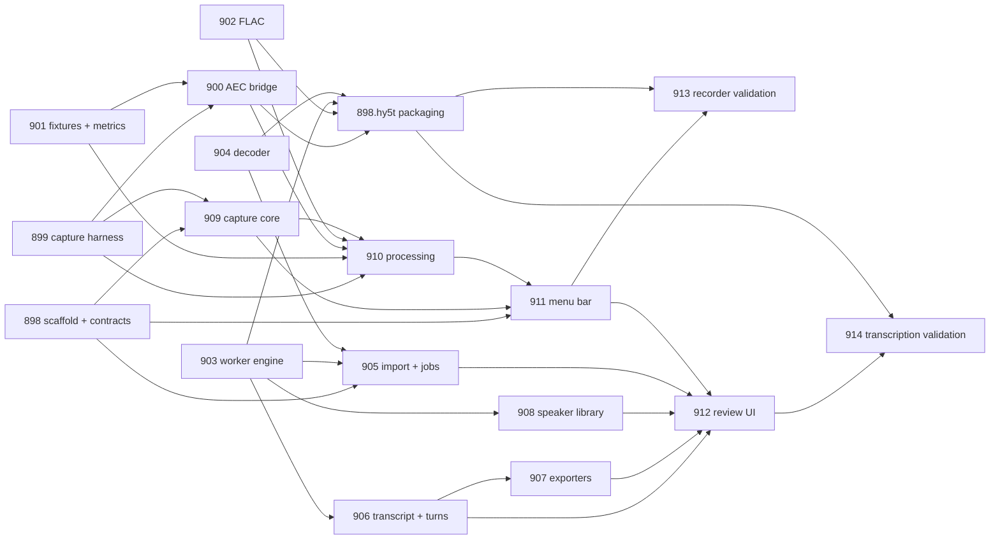

# Mission sequencing for the Scribe MVP

This maps the two implementation plans ([IMPLEMENTATION_PLAN.md](../IMPLEMENTATION_PLAN.md) and [TRANSCRIPTION_IMPLEMENTATION_PLAN.md](../TRANSCRIPTION_IMPLEMENTATION_PLAN.md)) onto 17 Overlord missions. Each mission is one parallel workstream with sequential objectives. A mission can be launched as soon as its first objective's inputs exist; later objectives inside a mission may wait on other missions, and each such objective says so in its own text.

## Before launching anything

1. **Make the initial commit.** The repository has no commits; the plans, `.gitignore`, `CLAUDE.md`, and `AGENTS.md` are untracked. Parallel agents need a shared base.
2. **Use one branch or worktree per mission.** Nine missions can run at once. They are laid out in disjoint directories, but only if the host scaffold (coo:898) makes every module, worker, tool, and native bridge a local Swift package. Until coo:898.q5fb lands, feasibility missions build as standalone Swift packages and must not create or edit an Xcode project.
3. **Machine prerequisites the agents cannot supply:** an Apple Developer ID certificate for the packaging objective, Screen & System Audio Recording and Microphone permission grants for the capture harness, a USB and a Bluetooth microphone for the device matrix, and consented recordings with reference transcripts for the transcription evaluation set.

## Wave 1: launch now (no external inputs)

| Mission | First objective | Later objectives that wait |
| --- | --- | --- |
| coo:898 Host app scaffold, shared contracts, packaging | coo:898.q5fb scaffold | coo:898.xq69 contracts follows immediately; coo:898.hy5t packaging waits until all native binaries exist (last) |
| coo:899 ScreenCaptureKit capture feasibility harness | coo:899.v4pe | coo:899.skwb and coo:899.dmrv follow in sequence |
| coo:900 WebRTC AEC3 bridge and offline AEC harness | coo:900.dkqd | coo:900.3tm0 follows; coo:900.6h1x waits on coo:901 (both) and coo:899.dmrv fixtures |
| coo:901 Synthetic audio fixture suite and metrics | coo:901.qkrr | coo:901.4hkx follows |
| coo:902 FLAC encoding path | coo:902.ezhy | coo:902.qepr follows |
| coo:903 Transcription worker engine feasibility | coo:903.60dk | coo:903.jq4g, .ejjc, .kwv7 follow in sequence |
| coo:904 Audio decoding and media probing | coo:904.0prx | coo:904.6cc6 follows |
| coo:906 Canonical transcript schema and turn builder | coo:906.0t5v | coo:906.hswe follows; coo:906.hqq2 waits on coo:903.jq4g |
| coo:908 Speaker library and identity matcher | coo:908.w8rd | coo:908.ytcb follows; coo:908.evfr waits on coo:903.ejjc |

Within a mission, an objective marked "follows" depends only on the one before it and is safe to queue with `ovld protocol update-objective --objective-id <id> --auto-advance`.

## Wave 2: launch after one specific objective delivers

| Mission | Launch after | Notes |
| --- | --- | --- |
| coo:907 Transcript exporters | coo:906.0t5v (schema) | Both objectives then run in sequence with nothing else to wait for |
| coo:911 Menu-bar workflow, shortcuts, settings | coo:898.q5fb (scaffold) | coo:911.f0xa and .tr0d build against a mock coordinator; coo:911.gkfb waits on coo:909 and coo:910 |
| coo:909 Recorder capture core | coo:898.xq69 (manifest model) | coo:909.w3g7 needs only the manifest; coo:909.b5gj also needs coo:899.skwb findings; coo:909.dz5k follows |
| coo:905 Transcription import, jobs, worker client | coo:898.xq69, coo:903.60dk, coo:904.0prx | All three must exist: handoff types, worker protocol, prober |

## Wave 3: launch after a chain completes

| Mission | Launch after | Notes |
| --- | --- | --- |
| coo:910 Recorder offline processing pipeline | coo:909.w3g7, coo:899.skwb, coo:901 (both), coo:902.qepr, coo:900.6h1x | .36p4 timeline builder first; .cz48 mixdown needs the finished AEC bridge |
| coo:912 Transcript review interface and integration | coo:906.0t5v and coo:907 (for .nh3a) | .e95c also needs coo:908.ytcb; .j7gh needs coo:905, coo:911.gkfb, coo:903.kwv7 |
| coo:913 Recorder release validation | coo:911.gkfb | Single objective; needs a human at the machine for the device matrix |
| coo:914 Transcription release validation | coo:912.j7gh | .546k needs the consented evaluation set |
| coo:898.hy5t Packaging and notarization | coo:900, coo:902, coo:903, coo:904, and the app | Run before the clean-machine parts of coo:913 and coo:914 |

## Dependency graph

## Critical path

The recorder's critical path runs through the capture harness findings (coo:899.skwb), the capture core, the processing pipeline, and menu-bar integration: 899 → 909 → 910 → 911 → 913. The transcription path runs 903 → 905 → 912 → 914. The AEC work (900 with 901) is the biggest technical risk and gates 910; start it on day one.
